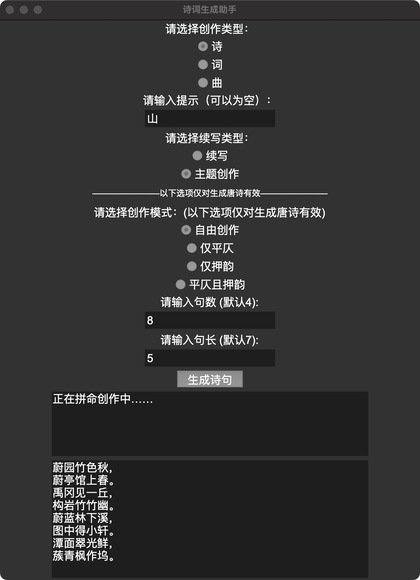

# 诗词生成助手

 丁玺博 李健宁 肖庆成

---

## 项目简介

本诗词生成助手是一个基于深度学习的应用程序，旨在自动生成各种类型的中文诗词。本项目利用Pytorch基础模块自行构建了Transformer架构，利用了PyTorch框架和自行构建的Transformer模型进行训练和推理，支持自由创作、平仄、押韵等多种创作模式。

## 功能

- 支持通过各种形式搭建任意结构的Transformer，并进行不同类型的训练任务的Transformer模块。
- 支持生成 **诗**、**词**、**曲** 三种类型的文本。
- 提供多种创作模式：自由创作、仅平仄、仅押韵、平仄且押韵
- 续写功能，能够在已有文本的基础上进行扩展。
- 主题词创作，能够根据给定主题词进行创作。
- 支持操作台使用和图形用户界面（GUI），方便用户操作和查看生成结果。

## 目录结构

```bash
.
└── simpleTransformer
    ├── data                                        # 数据集    
    ├── model                                       # 模型
    ├── classes.py                                  # 自定义Transfomer的类定义
    ├── CompareClass.ipynb                          # 比较自定义类和Pytorch类
    ├── trans.ipynb                                 # 模型训练和推理展示
└── PoemWriter
    ├── data.py                                     # 预处理数据集
    ├── assistant.py                                # 诗词生成逻辑
    ├── main.py                                     # 程序入口
    ├── poemUI.py                                   # GUI界面
    ├── trans_poem.py                               # 预处理和模型训练
    ├── requirements.txt                            # 依赖包
    ├── model                                       # 字典、模型
    └── data                                        # 数据集和辅助函数
```

## 安装依赖

在使用本项目之前，请确保已安装以下依赖。可以通过以下命令安装：

```bash
pip install -r ./PoemWriter/requirements.txt
```

## 使用方法

**运行程序**： \
   如果您想通过操作台使用，可以执行 `main.py` 文件以启动程序。 \
   如果您有频繁的操作需要，建议你进入可视化界面操作，可以执行`poemUI.py`文件以启动程序。

   ```bash
   cd PoemWriter
   python main.py
   python poemUI.py
   ```

**选择需求**： \
    如果您在操作台执行程序，请根据提示填写想要需求，程序会直接返回您提示和生成结果。 \
    如果您在GUI界面，可以直接填写您的全部需求，点击生成按钮在下方结果框内查看生成结果，期间的提示会返回上方提示框。

**示例**：

<!-- ```bash
请选择创作类型：
1. 诗
2. 词
3. 曲
请输入对应数字 (1/2/3): 1
当前设备: cpu
请输入提示（可以为空）：山
请选择续写类型（1. 续写 2. 主题创作）：2
请选择创作模式：
1. 自由创作
2. 仅平仄
3. 仅押韵
4. 平仄且押韵
请输入对应数字 (1/2/3/4): 1
请输入句数 (默认4): 
请输入句长 (默认7): 

正在创作中……
图招兴未消百草，
濮薝卜林逋有余。
蔚黄金锁香凉月，
蔟青溪路遥兮白。
``` -->

```bash
请选择创作类型：
1. 诗
2. 词
3. 曲
请输入对应数字 (1/2/3): 1
当前设备: cpu
请输入提示（可以为空）：一花一世界
请选择续写类型（1. 续写 2. 主题创作）：1
请选择创作模式：
1. 自由创作
2. 仅平仄
3. 仅押韵
4. 平仄且押韵
请输入对应数字 (1/2/3/4): 3
请输入句数 (默认4): 
请输入句长 (默认7): 

正在拼命创作中……
抱歉押韵需要多次尝试，正在为您重新生成。
一花一世界春深，
洲绡竹径微阴阴。
黄黄叶径阴阴生，
阴竹篱落处黄金。
```



## 文件说明

simpleTransformer是基础的Transformer架构类定义和基础模型展示，PoemWriter是古诗写作助手的封装。
以下对本项目核心文件进行介绍。

### simpleTransformer

#### classes.py

自定义的Transformer基础模块，仅利用Pytorch中线性层构建包括编码器、嵌入层、注意力模块、残差连接和层归一化、全连接前馈神经网络、Transformer等类。具体来讲，包括：

- 分词器Tokenizer：用于将文本转换为索引，支持编码和解码功能，并处理特殊标记（如\<unknown>、\<pad>、\<eos>、\<bos> 等）。
- 数据集MyDataset：继承自 TensorDataset，用于将文本转换为索引并进行填充。
- Transformer 架构：
  - TransformerEncoderDecoder：实现编码器和解码器的逻辑。
  - Transformer：整合各个组件，处理前向传播并生成输出。

#### Compare.ipynb

比较自定义的Transformer架构各模块和Pytorch库中相应模块的文件，确保实现正确。

#### trans.ipynb

使用 Pytorch 库中的线性层等简单的模块，自己实现 Transformer 的相应机制和模块，构建一个能够根据输入的前半句古诗输出后续内容的 Transformer。

- 数据预处理preprocess_data：读取和过滤输入数据，返回处理后的诗歌文本和词汇表。
- 使用classes.py中的类（为方便展示，我们在本文件中复制了classes中类定义的代码）实现一个Transformer模型预测古诗。

### PoemWriter

#### 数据预处理：data.py

我们选用了来自github上的公开数据集[chinese-poetry](https://github.com/chinese-poetry/chinese-poetry)。

为了方便训练模型，我们小组对数据集进行了一定的处理，提取了数据集中的古诗词，像四书五经之类的就没有提取。

- data.py 将繁体转化为简体，并将一首古诗词按照'题目：正文'的格式放到一行中，保存为txt文件。
- 提取后的数据集 本文件夹包含了所有提取后的数据集
- 需要从github上下载原数据集chinese-poetry-master.zip解压后使用。

#### **trans_poem.py**

该文件实现了一个基于 Transformer 架构的诗歌生成模型，主要内容与simpleTransformer中的classes.py和trans.ipynb相同。

**训练过程**： 包含训练循环，优化模型参数并保存模型和分词器。
**功能**：

- 数据预处理：过滤不符合条件的诗歌文本，并生成词汇表。
- 文本编码：将文本转换为索引序列，支持填充和截断。
- 模型构建：构建 Transformer 模型，包含注意力机制和前馈网络。
- 训练与保存：训练模型，并将最终模型和分词器参数保存到文件。
  
**使用方式**：

- 准备数据：将需要处理的文本数据放在指定路径下（默认为 data/tangshi.txt）。
- 运行脚本：可以使用命令行运行该脚本，通过参数指定数据路径：
  
    ```bash
    cd PoemWriter
    python trans_poem.py --data_path data/tangshi.txt
    ```

- 模型训练：脚本将自动读取数据、预处理、训练模型并保存结果。

**亮点**：

- 动态处理：支持对输入数据的灵活预处理，包括最大和最小长度限制、禁用词过滤等。
- 模块化设计：将Transformer模型构建分为多个独立模块，易于理解和扩展。
- 支持 GPU 加速：自动检测并使用 GPU，提高训练效率。

#### **assistant.py**

该文件基于训练好的模型进行创作，主要功能包括诗句生成、平仄检查和押韵验证，包含以下主要部分：

- PoetryGenerator 类：核心类，用于生成诗歌，支持多种创作模式。
  - 初始化：设置诗歌类型、提示词、生成模式、句子数量和句长。
  - load_model：动态加载不同类型的模型和分词器。
  - generate/continue(_freestyle/pingze/rhyme)_poem：根据用户输入生成符合平仄和押韵要求的诗句。
- 辅助方法：
  - _predict和_predict_strict：生成候选字，分别用于随机推理和和严格推理。
  - _check_pingze 和 _check_rhyme：检查生成的音节是否符合平仄和押韵规则。
  - get_rhyme_info：提取汉字的韵母和声调信息，辅助平仄和押韵的判断。
  - generate_prompt：随机生成一个主题，用于诗句的起始。

**功能**：

- 诗句生成：支持自由创作、平仄和押韵的多种生成模式。
- 平仄与押韵检查：确保生成的诗句符合传统的汉字韵律要求。
- 随机主题生成：在未提供提示词时自动生成主题。

**使用方式**：

- 准备数据：确保模型所需的分词器和模型文件存在于指定路径（如 model/tangshi_tokenizer_tokens.txt 和 model/tangshi_model.pth）。
- 运行脚本：通过用户定义的输入参数调用生成方法，示例代码如下：

    ```python
    generator = PoetryGenerator(poetry_type='诗', prompt='春天', mode='自由创作')
    poem = generator.generate_poem(num_lines=4, line_length=7)
    print(poem)
    ```

**亮点**：

- 随机推理：通过两种文本生成预测，在保证速度的同时大大提高了生成内容的丰富度。
- 详细平仄与押韵验证：通过声调和韵母的精确检查，确保生成的诗句符合传统韵律要求。
- 区分处理：通过分设不同的函数尽可能减少判断和循环的时间。对续写和主题创作设立了完全不同的推理逻辑，续写的推理逻辑需要保证连贯性并在句末插入“停
止”，这样可以避免生成结果在性质上属于“一句连续的话强行断开”；而主题创作的推理逻辑需要保证内容始终围绕关键词，在每句话成功生成后都要重新返回关键词附近进行推理。

#### **main.py & poemUI.py**

该文件接收外部用户参数，传递给assistant.py中的PoetryGenerator类，返回中途提示以及生成结果。

## 注意事项

- 如果要从训练开始完整运行该项目，请确保已正确安装相应的CUDA版本（如果使用GPU）。
- 生成的诗词质量可能因模型训练数据和参数设置而异。如果出现多次失败建议修改要求，或者调整`assistant.py`中`tolerance`参数，其含义是每次随机生成考虑的字符数量上限。

---

感谢您的阅读，最后放一首借助本项目创作的七言绝句。 \
构青山脚斜溪上，
禹陵寺来台上崔。
濮园竹径开时隐，
蔚蓝碧树低时规。
